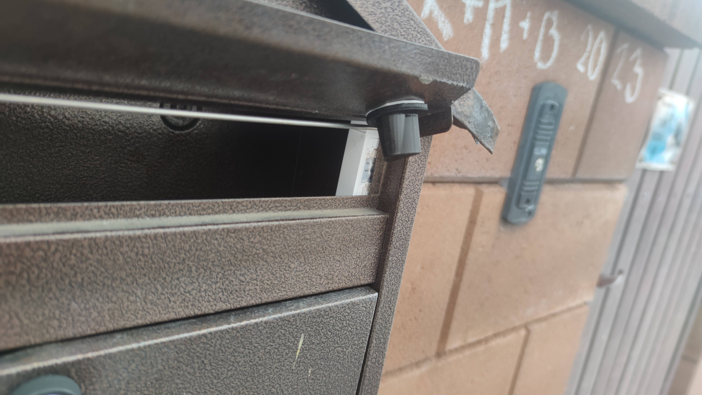
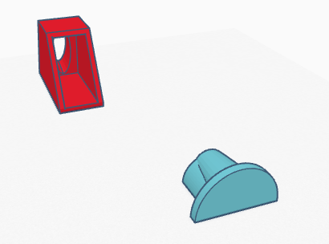
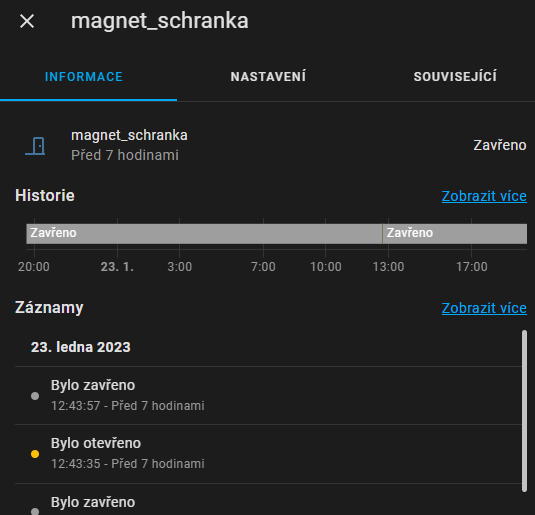
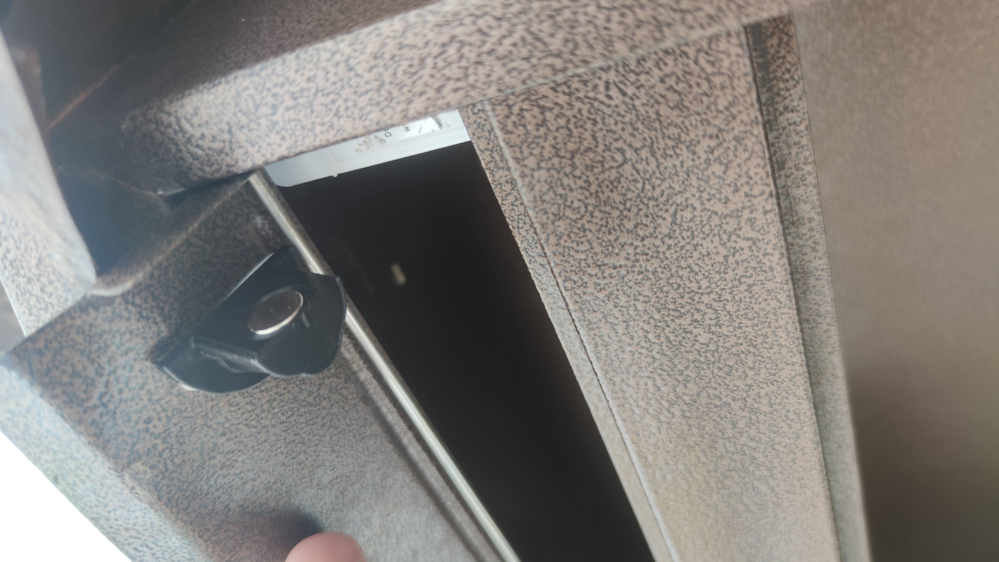
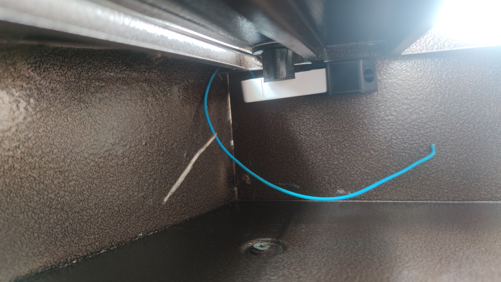
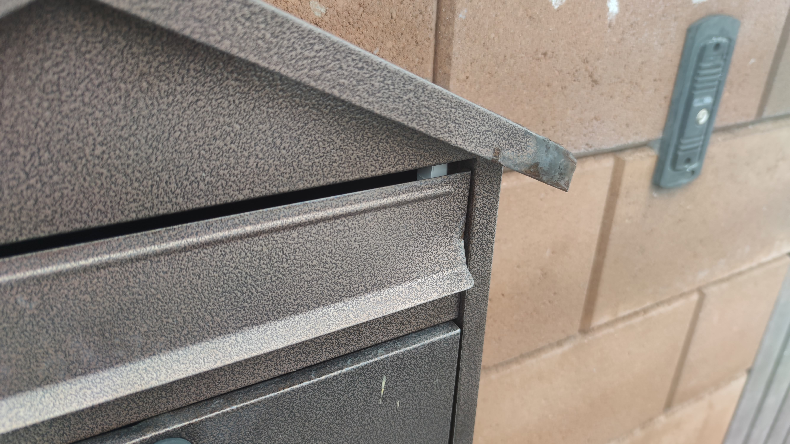

# leboxan - LEtter BOX ANnouncer

## Introduction
Since I am too lazy to check out mailbox regularly and have not found a suitable and cost effective solution for me (yes, I know about Ring devices), I have rediscovered the wheel as usual :-)

Recently I stopped the network at 433Mhz, i.e. I have two heaps of unused sensors at home. I tried to give one of them second chance with this project.

I used door/window magnetic contact (with states for open and close) - you know why - I have a status update when the cover is held up and when it is in place (someone has put something in the mailbox).

All together with some Home Assistant notifications to telegram.

Sensor holder should be "universal" currently using some unknown door/window sernsor from Aliexpress, tested also with Immax Neo 07518L.



## 3D models

 

I created both models of holders - for sensor & for magnet (2.5x10). There is also hole in the bottom of sensor holder.

Currently all holders are sticked with double sided 3M tape.


### Tinkercad

https://www.tinkercad.com/things/dTlbBKHksg4?sharecode=Zzq38p6rL5rD39_FJC4A53y84hIkt56r7mo85jYLFYg

### STLs

(files)[stl]

## Home Assistant

sensor goes via mqtt to `binary_sensor.magnet_schranka`

 


### automation configuration
```
alias: Open of letter box
description: ""
trigger:
  - platform: state
    entity_id:
      - binary_sensor.magnet_schranka
    to: "on"
condition: []
action:
  - data:
      data:
        photo:
          - url: >-
              https://ha.ip.addresaa:port{{states.camera.besder_brana.attributes.entity_picture}}
      message: Schránka byla otevřena
    service: notify.telegram_mirecek
```

## Photos

 
 
                                        
     


